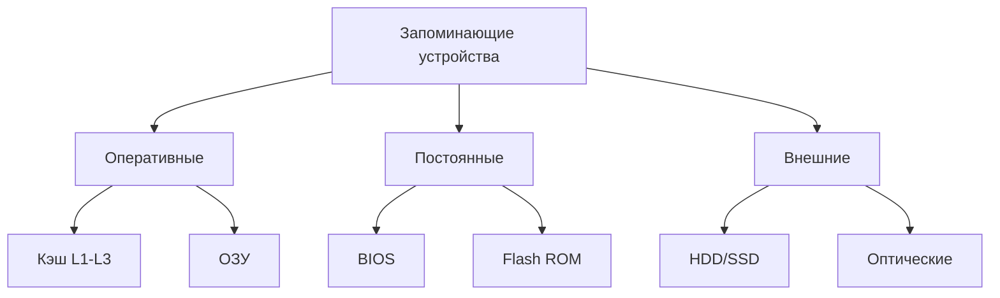

## 1. Классификация ЗУ по характеристикам

### 1.1. По энергозависимости
| Тип              | Сохранение данных | Примеры               |
|------------------|-------------------|-----------------------|
| **Энергозависимые** | Только при питании | ОЗУ, кэш-память       |
| **Энергонезависимые** | Без питания     | ПЗУ, флеш-память, HDD |
### 1.2. По назначению

### 1.3. По способу доступа

- **Произвольный доступ (RAM)**: время доступа не зависит от адреса
    
- **Последовательный доступ**: время зависит от положения (маг. ленты)
    
- **Прямой доступ**: блоковый доступ (жесткие диски)
    
- **Ассоциативный доступ**: по содержимому (TLB, кэш)
    

## 2. Основные характеристики ЗУ

### 2.1. Ключевые параметры

1. **Ёмкость**: 8 ГБ ОЗУ, 1 ТБ SSD
    
2. **Время доступа**:
    
    - Кэш L1: 0.5-2 нс
        
    - ОЗУ: 10-100 нс
        
    - SSD: 10-100 мкс
        
3. **Пропускная способность**: ГБ/с
    
4. **Надёжность**: MTBF (часы наработки на отказ)
    
5. **Энергопотребление**: Вт/ГБ
    

### 2.2. Иерархия памяти (пирамида)
▲ Скорость
│
├── Регистры (1 такт)
├── Кэш L1 (2-4 такта)
├── Кэш L2 (10-20 тактов)
├── Кэш L3 (30-50 тактов)
├── ОЗУ (100-300 тактов)
└── Внешняя память (тысячи тактов)
## 3. Организация запоминающих устройств

### 3.1. Оперативная память (ОЗУ)

**Структура ячейки:**
[Битовая линия] ←→ [Транзистор] ←→ [Конденсатор]
**Типы:**

- **DRAM** (Dynamic RAM):
    
    - Требует регенерации
        
    - Высокая плотность
        
    - Используется как основная ОЗУ
        
- **SRAM** (Static RAM):
    
    - Быстрее в 2-3 раза
        
    - Дороже
        
    - Используется в кэш-памяти
        

### 3.2. Кэш-память

**Принципы организации:**

- **Ассоциативность**:
    
    - Прямоотображенный кэш
        
    - Наборно-ассоциативный
        
    - Полностью ассоциативный
        

**Политики замещения:**

- LRU (Least Recently Used)
    
- FIFO
    
- Случайный выбор
    

### 3.3. Постоянные ЗУ

**Технологии:**

- **NOR Flash**: быстрый произвольный доступ (BIOS)
    
- **NAND Flash**: высокая плотность (SSD)
    
- **3D XPoint**: энергонезависимая память с DRAM-скоростью
    

## 4. Современные тенденции

### 4.1. Новая память

- **HBM** (High Bandwidth Memory): 3D-стэкирование
    
- **Optane**: на основе 3D XPoint
    
- **MRAM**: магниторезистивная память
    

### 4.2. Оптимизации доступа

- **Prefetching**: предварительная выборка
    
- **Буферизация**: write-back кэши
    
- **Видеопамять GDDR6**: до 24 ГБ/с на чип
