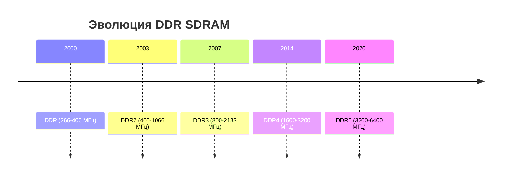

# Оперативные запоминающие устройства (ОЗУ)

## 1. Основные характеристики ОЗУ
**Оперативное запоминающее устройство (ОЗУ)** — это энергозависимая память компьютера, используемая для временного хранения данных и команд, необходимых процессору для выполнения операций в реальном времени.

**Ключевые параметры:**
- **Ёмкость**: От 4 ГБ до 2 ТБ в потребительских системах
- **Тактовая частота**: 1600-6400 МГц (DDR4/DDR5)
- **Латентность (CL)**: 14-40 тактов
- **Пропускная способность**: До 51.2 ГБ/с (DDR5-6400)
- **Напряжение питания**: 1.2V (DDR4), 1.1V (DDR5)

## 2. Типы оперативной памяти

### 2.1. По технологии
| Тип       | Принцип работы                  | Преимущества               | Недостатки              |
|-----------|---------------------------------|----------------------------|-------------------------|
| **SRAM**  | 6 транзисторов на бит          | Высокая скорость           | Низкая плотность        |
| **DRAM**  | 1 транзистор + конденсатор      | Высокая плотность          | Требует регенерации     |
| **SDRAM** | Синхронная работа с шиной       | Эффективное использование  | Сложнее контроллер      |

### 2.2. По поколениям

## 3. Организация DRAM

### 3.1. Структура чипа
Банки → Строки → Столбцы
- **Банк**: Независимая субматрица (8-16 банков)
    
- **Страница**: Открытая строка в банке
    
- **Ячейка**: Конденсатор + транзистор (~30fF)
    

### 3.2. Временные параметры

- **tRCD**: Row-to-Column Delay (15-20ns)
    
- **tRP**: Row Precharge Time (15-20ns)
    
- **tRAS**: Row Active Time (35-50ns)
    

## 4. Контроллер памяти

### 4.1. Функции:

- Управление банками
    
- Регенерация (64ms refresh)
    
- Очередь команд
    
- Поддержка многоканальности
    

### 4.2. Режимы работы:

- **Single-channel**
    
- **Dual-channel**
    
- **Quad-channel**
    
- **Flex Mode** (гибридные конфигурации)
    

## 5. Современные технологии

### 5.1. DDR5 нововведения:

- **Двухканальная структура** (32/40 бит на модуль)
    
- **On-die ECC** для повышения надёжности
    
- **Decision Feedback Equalization** для целостности сигнала
    

### 5.2. Память для серверов:

- **Registered DIMM** (RDIMM)
    
- **Load-Reduced DIMM** (LRDIMM)
    
- **Non-Volatile DIMM** (NVDIMM)
    

## 6. Оптимизация работы

### 6.1. Профили XMP/EXPO

- Предустановленные разгоны
    
- Автоматическая настройка таймингов
    
- Поддержка в BIOS/UEFI