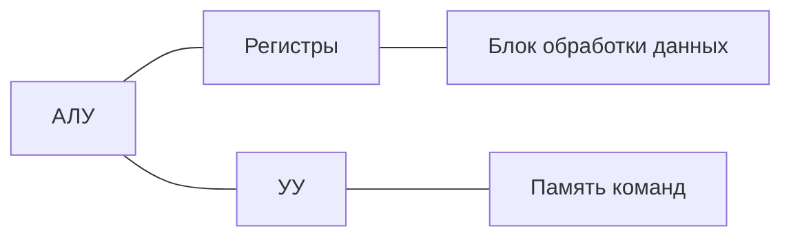
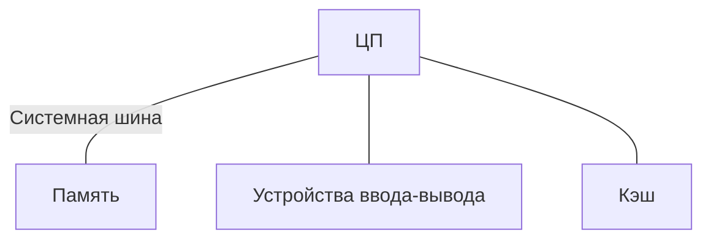

# Обобщенная структура процессоров с непосредственной и магистральной связью

## **1. Классификация структур процессоров**
- **Непосредственная связь (радиальная организация)**  
  - Компоненты соединены напрямую через выделенные линии связи  
  - Примеры: стековые процессоры, ранние RISC-модели  

- **Магистральная организация (шинная архитектура)**  
  - Компоненты подключены к общей шине данных/адресов  
  - Примеры: x86, ARM, большинство современных CPU  

## **2. Структура процессора с непосредственной связью**

**Характеристики:**

- Минимальные задержки передачи данных
    
- Сложность масштабирования
    
- Высокая стоимость проектирования
    
- Используется в специализированных процессорах
    

## **3. Магистральная структура процессора**

**Компоненты:**

1. **Центральный процессор**:
    
    - АЛУ
        
    - УУ
        
    - Регистровый файл
        
2. **Шинные интерфейсы**:
    
    - Шина данных (32/64 бит)
        
    - Шина адреса
        
    - Шина управления
        

**Преимущества:**

- Универсальность
    
- Простота расширения
    
- Экономичность
    

## **4. Сравнительная таблица**

|Параметр|Непосредственная связь|Магистральная организация|
|---|---|---|
|Быстродействие|Высокое|Среднее|
|Масштабируемость|Низкая|Высокая|
|Стоимость реализации|Высокая|Низкая|
|Типичное применение|Специализированные системы|Универсальные компьютеры|

## **5. Современные гибридные подходы**

- Использование обоих принципов:
    
    - Ядро процессора - радиальная организация
        
    - Взаимодействие с периферией - через шины
        
- Пример: многоядерные процессоры с:
    
    - Быстрой внутренней шиной (QPI, Infinity Fabric)
        
    - Медленной внешней шиной