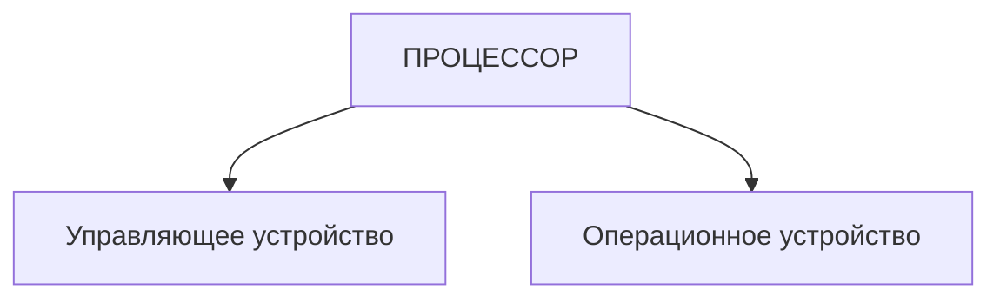
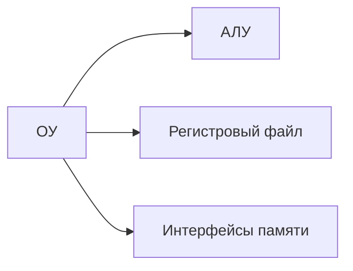
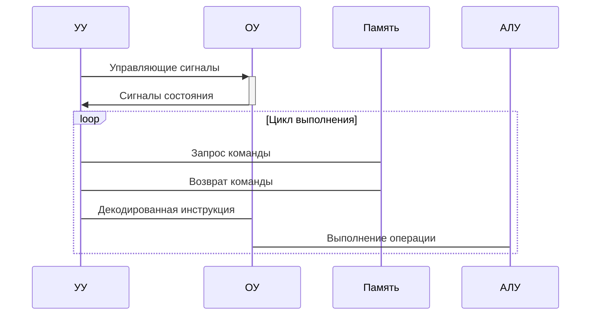

# Декомпозиция процессора на управляющие и операционные устройства

## **1. Функциональное разделение процессора**

## **2. Управляющее устройство (Control Unit)**

### **Состав:**

- **Дешифратор команд**
    
- **Генератор управляющих сигналов**
    
- **Счетчик команд (PC)**
    
- **Регистр команд (IR)**
    

### **Функции:**

1. Выборка команд из памяти
    
2. Декодирование инструкций
    
3. Генерация управляющих сигналов
    
4. Координация работы всех узлов
    

## **3. Операционное устройство (Datapath)**

### **Основные компоненты:**

### **Функциональные блоки:**

1. **Арифметико-логическое устройство (АЛУ)**:
    
    - Выполнение вычислений
        
    - Логические операции
        
    - Побитовая обработка
        
2. **Регистровая подсистема**:
    
    - Общего назначения (R0-R15)
        
    - Специальные регистры (флаговые, указатели)
        
3. **Интерфейсы данных**:
    
    - Шины ввода/вывода
        
    - Кэш-контроллеры
        
    - Буферы предвыборки
        

## **4. Принцип взаимодействия**

## **5. Сравнительная характеристика**

|Критерий|Управляющее устройство|Операционное устройство|
|---|---|---|
|**Основная функция**|Координация выполнения|Выполнение операций|
|**Быстродействие**|Определяет такт процессора|Зависит от разрядности|
|**Сложность**|Микроархитектурный уровень|Битовая/словная обработка|
|**Эволюция**|CISC → RISC → VLIW|SIMD → MIMD → Tensor cores|