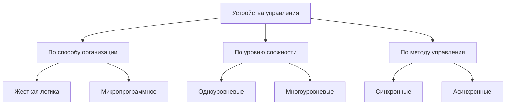
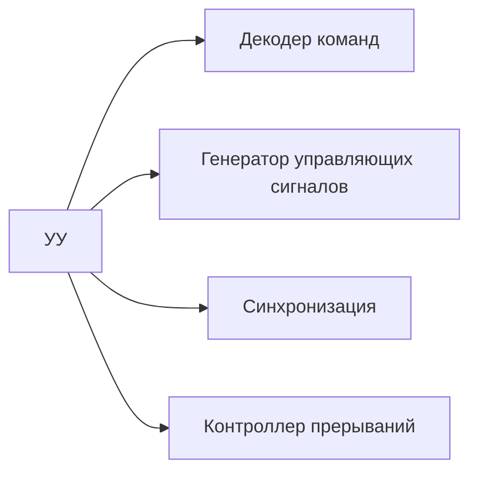
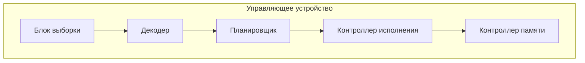
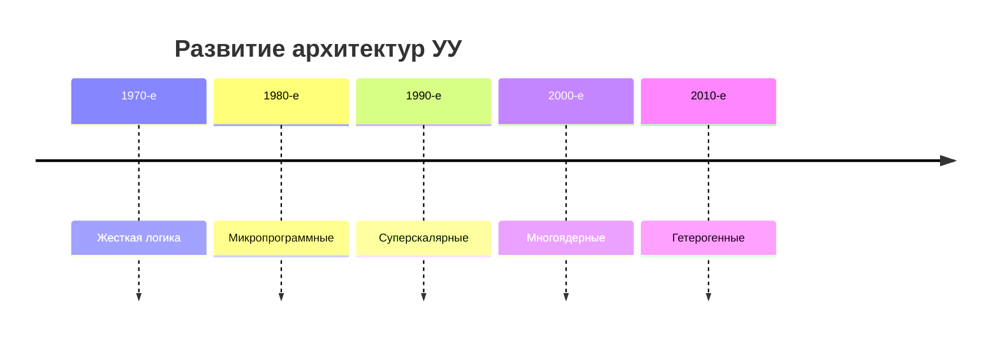

# Классификация устройств управления и их декомпозиция

## 1. Иерархическая классификация УУ

## 2. Декомпозиция устройства управления

### Основные функциональные блоки:

## 3. Подробная классификация

### 3.1 По способу реализации:

|Тип УУ|Характеристики|Примеры|
|---|---|---|
|**Жесткая логика**|Фиксированные схемы, высокая скорость|RISC-процессоры|
|**Микропрограммное**|Гибкость, использование ПЗУ микрокоманд|CISC-процессоры|
|**Гибридное**|Комбинация подходов|Современные x86|

### 3.2 По уровню сложности:

1. **Базовый уровень**:
    
    - Управление тактированием
        
    - Дешифрация простых команд
        
2. **Продвинутый уровень**:
    
    - Предсказание ветвлений
        
    - Конвейерное управление
        
    - Out-of-order исполнение
        

## 4. Детальная декомпозиция УУ

### 4.1 Блок-схема современного УУ

### 4.2 Функциональные модули:

1. **Блок предвыборки**:
    
    - Буфер команд
        
    - Предсказатель ветвлений
        
2. **Декодирующий блок**:
    
    - Трансляция команд в микрооперации
        
    - Параллельный декодер
        
3. **Блок управления выполнением**:
    
    - Распределитель ресурсов
        
    - Контроллер конвейера
        

## 5. Эволюция архитектур УУ

## 6. Сравнение подходов к реализации

|Критерий|Жесткая логика|Микропрограммное|Гибридное|
|---|---|---|---|
|Быстродействие|+++|+|++|
|Гибкость|-|+++|++|
|Энергоэффективность|++|+|++|
|Сложность разработки|Высокая|Средняя|Очень высокая|