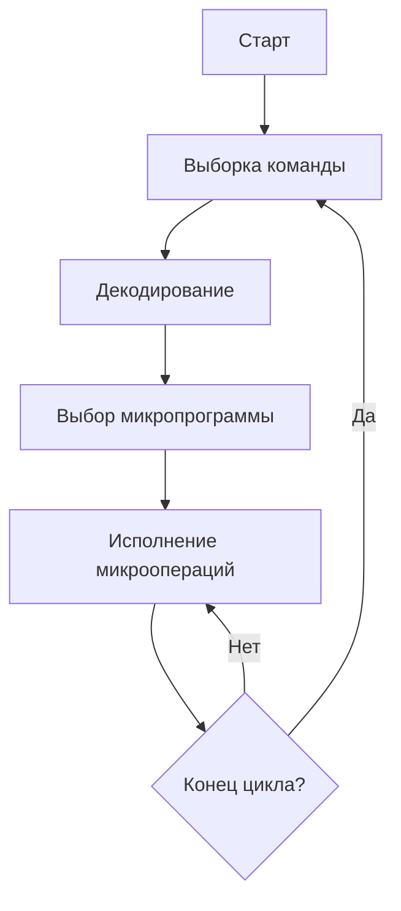
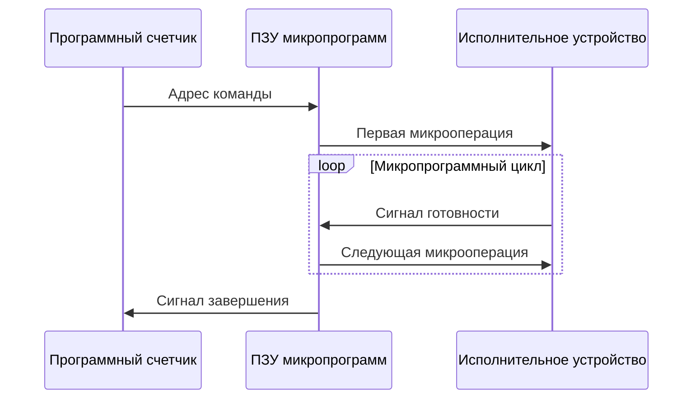
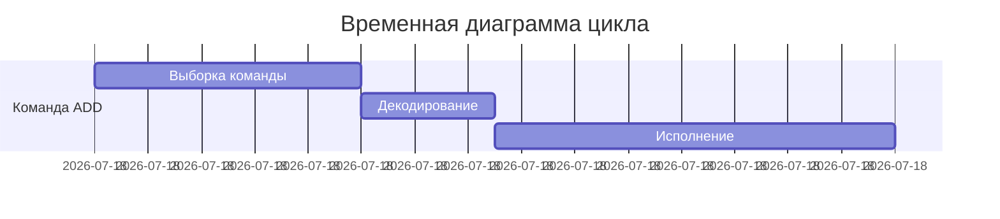

# Принцип микропрограммного управления циклами

## 1. Базовый цикл микропрограммного управления

## 2. Ключевые компоненты цикла

### 2.1 Функциональные элементы:

- **Счетчик микрокоманд (МСР)** - хранит адрес текущей микроинструкции
    
- **Регистр команд (IR)** - содержит выполняемую машинную команду
    
- **ПЗУ микропрограмм** - память с набором микроинструкций
    
- **Дешифратор** - преобразует код команды в начальный адрес микропрограммы
    

### 2.2 Фазы цикла:

1. **Выборка машинной команды**
    
2. **Определение точки входа в микропрограмму**
    
3. **Последовательное выполнение микроопераций**
    
4. **Возврат к выборке следующей команды**
    

## 3. Детализированный цикл выполнения

## 4. Типы микропрограммных циклов

### 4.1 Классификация по организации:

|Тип цикла|Характеристики|Пример применения|
|---|---|---|
|**Линейный**|Последовательное выполнение|Простые команды|
|**Разветвленный**|Условные переходы|Команды ветвления|
|**Вложенный**|Циклы в циклах|Обработка массивов|

### 4.2 Особые режимы:

- **Конвейерное исполнение** - перекрытие фаз разных команд
    
- **Параллельное выполнение** - для многоядерных систем
    
- **Прерываемые циклы** - обработка исключений
    

## 5. Временные характеристики

## 6. Оптимизация микропрограммных циклов

### 6.1 Методы ускорения:

1. **Кэширование микрокода**
    
2. **Предвыборка микроинструкций**
    
3. **Параллельное декодирование**
    
4. **Специализированные пути данных**
    

### 6.2 Показатели эффективности:

- CPI (Cycles Per Instruction)
    
- IPC (Instructions Per Cycle)
    
- Задержка конвейера