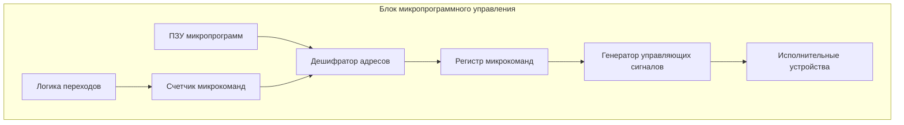
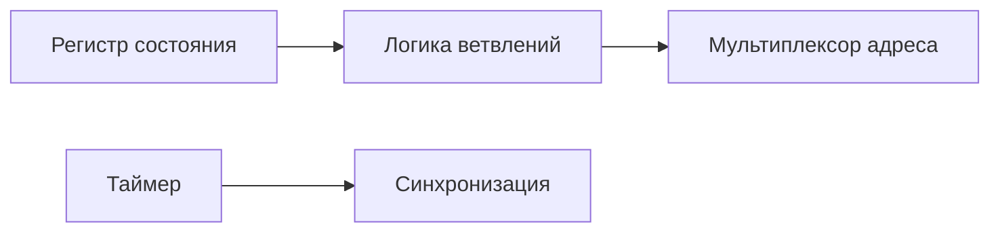
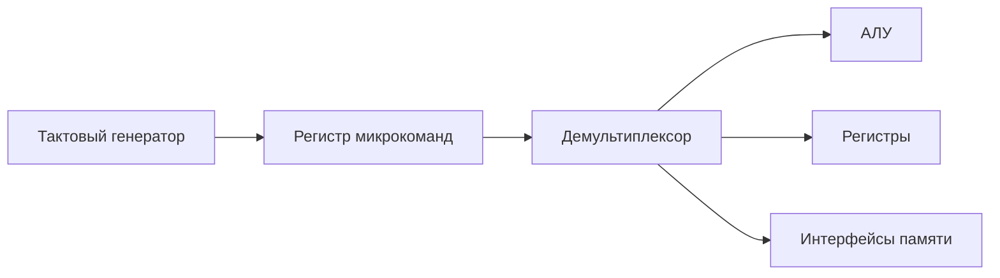
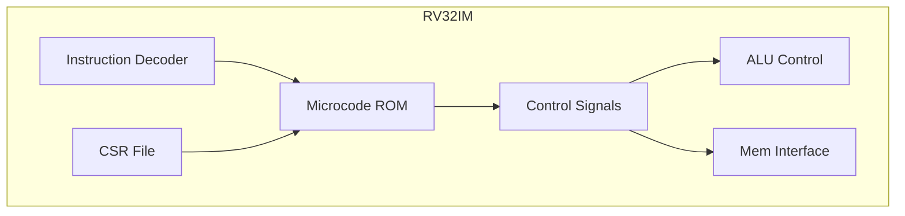

# Структура блока микропрограммного управления

## 1. Общая архитектура блока

## 2. Основные компоненты

### 2.1 Центральные элементы:

| Компонент                     | Назначение                     | Характеристики                           |
| ----------------------------- | ------------------------------ | ---------------------------------------- |
| **ПЗУ микропрограмм**         | Хранение микроинструкций       | Объем 1-16K слов, разрядность 32-128 бит |
| **Регистр микрокоманд**       | Буферизация текущей инструкции | Параллельная загрузка                    |
| **Счетчик микрокоманд (МСР)** | Адресация в ПЗУ                | С возможностью инкремента и перезагрузк  |
### 2.2 Вспомогательные блоки:

## 3. Детальная организация ПЗУ микропрограмм

### 3.1 Формат микрокоманды:

Copy

Download

[ Управляющие биты (60%) | Адрес перехода (20%) | Условия (20%) ]

### 3.2 Типы микрокоманд:

1. **Операционные** (управление АЛУ)
    
2. **Адресные** (переходы)
    
3. **Комбинированные** (управление + переход)
    

## 4. Схема работы генератора сигналов

## 5. Параметры проектирования

### 5.1 Ключевые характеристики:

|Параметр|Типовые значения|Влияние на производительность|
|---|---|---|
|Разрядность микрокоманды|32-128 бит|Определяет параллелизм управления|
|Объем ПЗУ|512-16К слов|Влияет на сложность команд|
|Время доступа к ПЗУ|1-5 тактов|Лимитирует тактовую частоту|

### 5.2 Оптимизации:

- **Горизонтальный микрокод** (максимальный параллелизм)
    
- **Вертикальный микрокод** (компактность)
    
- **Нанокод** (двухуровневая организация)
## 6. Пример реализации для RISC-V

