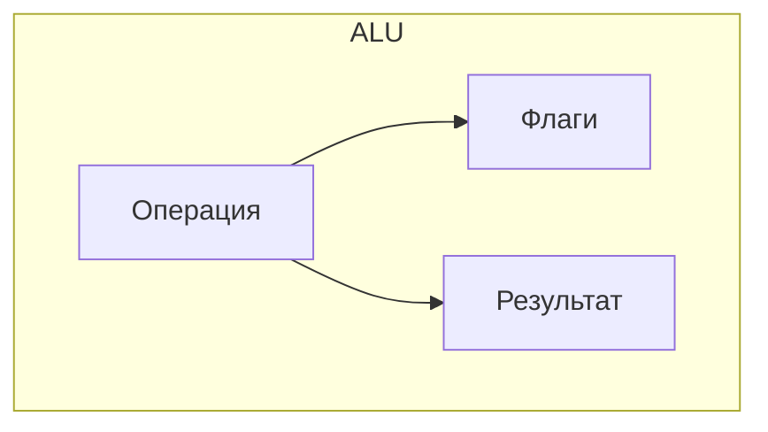

## 1. Базовый цикл выполнения команд

## 2. Детализация этапов цикла

### 2.1 Фаза выборки (Fetch)

- Чтение команды по адресу из PC
    
- Инкремент PC (+4 для 32-бит)
    
- Особые случаи:
    
    - Предвыборка (prefetch)
        
    - Кэш-промах
        
    - Очередь команд
        

### 2.2 Фаза декодирования (Decode)

| Действие                       | Время  | Компоненты       |
| ------------------------------ | ------ | ---------------- |
| Парсинг кода операции          | 1 такт | Декодер команд   |
| Чтение регистров               | 1 такт | Регистровый файл |
| Генерация управляющих сигналов | 1 такт | УУ               |
### 2.3 Фаза исполнения (Execute)

## 3. Временные характеристики

```mermaid
gantt
    title Рабочий цикл (5-стадийный конвейер)
    dateFormat  S
    section Цикл 1
    Fetch : 0, 1
    section Цикл 2
    Decode : 1, 1
    Execute : 2, 1
    Memory : 3, 1
    WriteBack : 4, 1
```

## 4. Особые ситуации

### 4.1 Прерывания цикла

- Аппаратные прерывания
    
- Исключения
    
- Ошибки предсказания ветвлений
    

### 4.2 Оптимизации

- Конвейеризация
    
- Спекулятивное исполнение
    
- Внеочередное выполнение
    

## 5. Сравнение архитектур

|Архитектура|Тактов на инструкцию|Особенности|
|---|---|---|
|RISC|~1|Фиксированная длина|
|CISC|1-15|Комплексные инструкции|
|VLIW|0.5-2|Пакетная обработка|