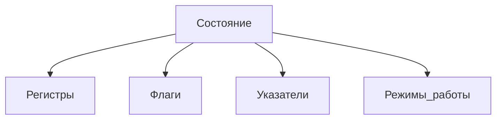
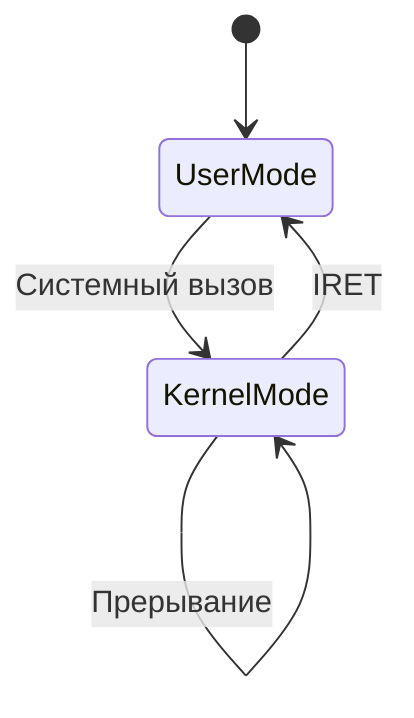
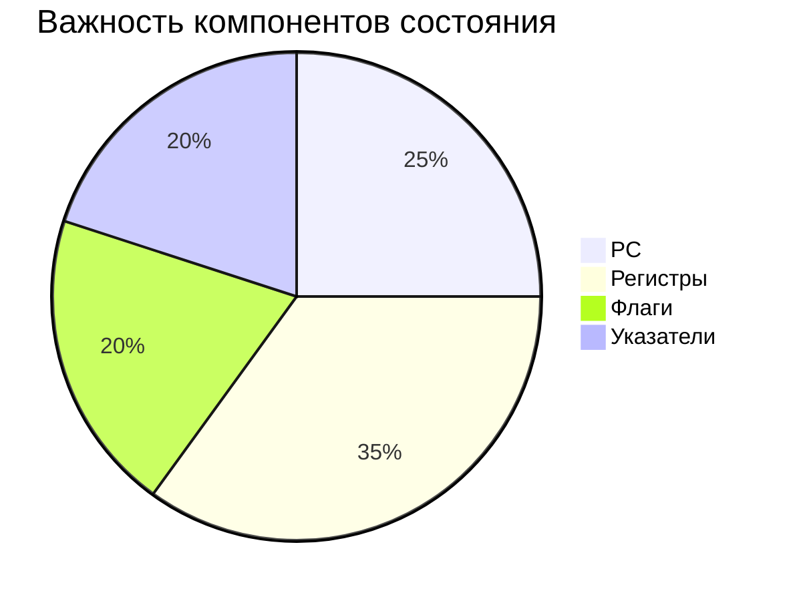

# Понятие о состоянии процессора

## 1. Определение состояния процессора
**Состояние процессора** - совокупность всех изменяемых параметров, определяющих текущий режим работы и контекст выполнения программы:

## 2. Основные компоненты состояния

### 2.1 Регистровый контекст

|Тип регистров|Содержимое|Важность|
|---|---|---|
|Общего назначения|Данные/адреса|Высокая|
|Специальные|PC, SP, BP|Критичная|
|Системные|CR0-CR4 (x86)|Средняя|

### 2.2 Слово состояния процессора (PSW)

[ Флаги | Код условия | Уровень привилегий | Режим работы ]

### 2.3 Критические указатели:

- **PC** (Program Counter) - текущая команда
    
- **SP** (Stack Pointer) - вершина стека
    
- **FP** (Frame Pointer) - базовый кадр
    

## 3. Диаграмма состояния процессора

## 4. Операции с состоянием

### 4.1 Сохранение состояния:

- При прерываниях
    
- При переключении контекста
    
- При системных вызовах
    

### 4.2 Восстановление состояния:

- POPF/IRET (x86)
    
- RFE (ARM)
    
- MRET (RISC-V)
    

## 5. Примеры регистров состояния

### 5.1 x86 (EFLAGS):
[CF|PF|AF|ZF|SF|TF|IF|DF|OF|...]
### 5.2 ARM (CPSR):
[N|Z|C|V|Q|J|GE|E|A|I|F|T|MODE]
## 6. Важность сохранения состояния

