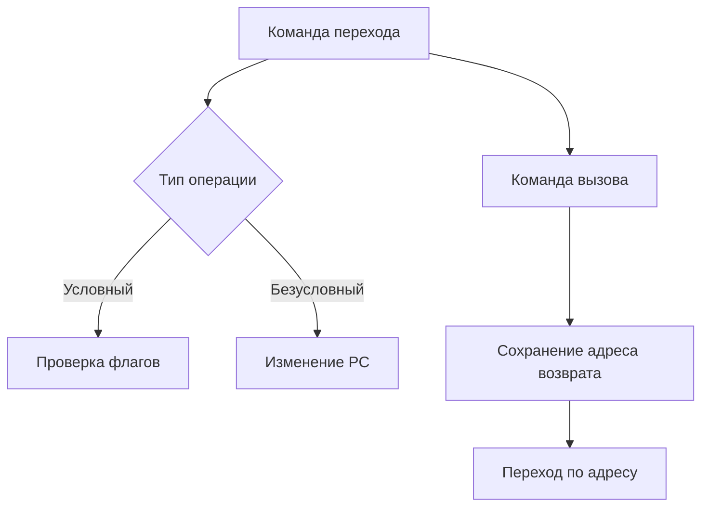
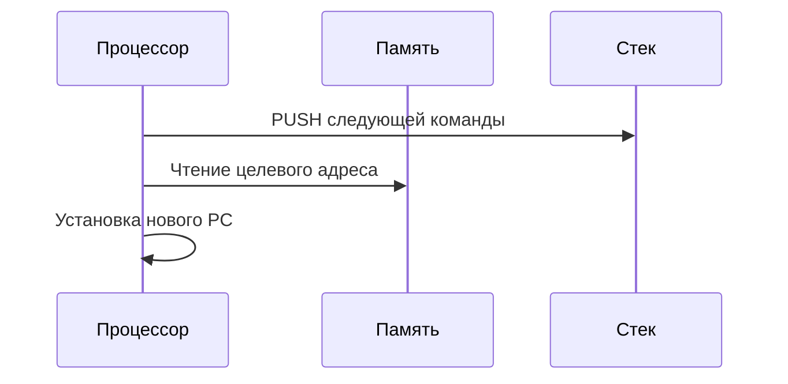

# Процедура выполнения команд перехода и вызова подпрограмм

## 1. Общая схема работы

## 2. Команды перехода (JMP)

### 2.1 Типы переходов:

|Тип|Особенности|Примеры|
|---|---|---|
|**Относительный**|Смещение от текущего PC|`JMP +0x12`|
|**Абсолютный**|Полный адрес назначения|`JMP 0x4032A1`|
|**Косвенный**|Адрес в регистре/памяти|`JMP [EAX]`|

### 2.2 Алгоритм выполнения:

1. Вычисление целевого адреса
    
2. Проверка условий (для условных переходов)
    
3. Обновление регистра PC
    

## 3. Команды вызова подпрограмм (CALL)

### 3.1 Этапы выполнения:

### 3.2 Особенности реализации:

- **Сохранение адреса возврата** (в стек/регистр)
    
- **Изменение PC** на адрес подпрограммы
    
- **Обработка вложенных вызовов**
    

## 4. Возврат из подпрограмм (RET)

### 4.1 Принцип работы:

1. Извлечение адреса возврата из стека
    
2. Восстановление PC
    
3. Коррекция указателя стека (SP)
    

### 4.2 Варианты инструкций:

- **Простой возврат** (без параметров)
    
- **Возврат со сбросом** (удаление аргументов)
    
- **Интерруптивный возврат** (IRET)
    

## 5. Сравнение операций

| Характеристика   | CALL | JMP | RET        |
| ---------------- | ---- | --- | ---------- |
| Сохраняет адрес  | Да   | Нет | Использует |
| Меняет PC        | Да   | Да  | Да         |
| Работа со стеком | Push | Нет | Pop        |