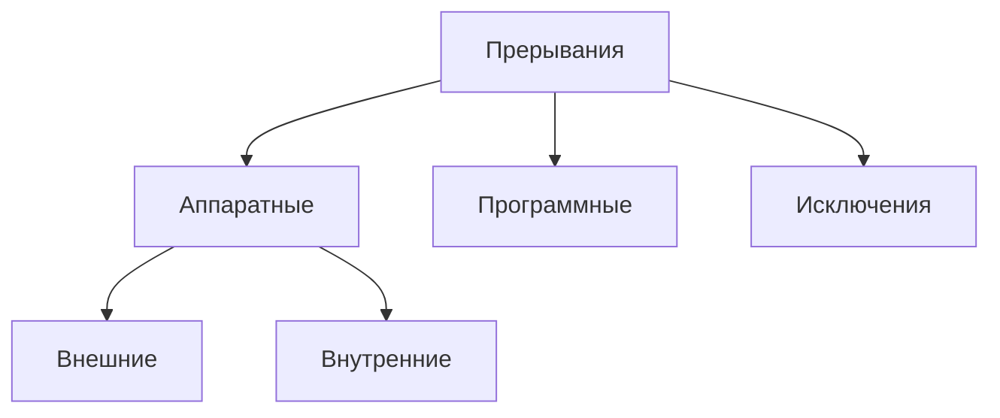
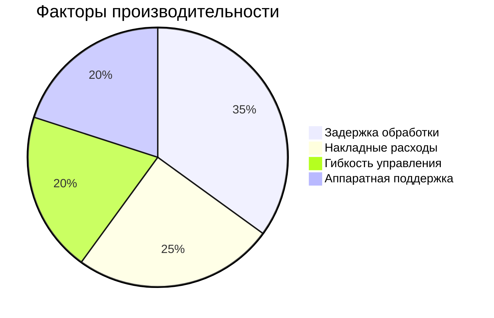

## 1. Классификация прерываний

## 2. Ключевые характеристики

### 2.1 Основные параметры:

|Характеристика|Описание|Примеры значений|
|---|---|---|
|Уровень вложенности|Макс. глубина обработки|2-7 уровней|
|Время реакции|Задержка до обработки|10-1000 тактов|
|Количество источников|Поддерживаемые устройства|8-256 линий|

### 2.2 Важные особенности:

- **Приоритетность** (статическая/динамическая)
    
- **Маскируемость** (глобальная/избирательная)
    
- **Автоматическое сохранение контекста**
    

## 3. Структура системы прерываний

## 4. Сравнение архитектур

### 4.1 x86 (Intel):

- Каскадные контроллеры (8259A)
    
- 256 векторов прерываний
    
- Программируемые приоритеты
    

### 4.2 ARM:

- Гибкий контроллер (GIC)
    
- 1024 возможных прерываний
    
- Групповая маскировка
    

## 5. Показатели эффективности

