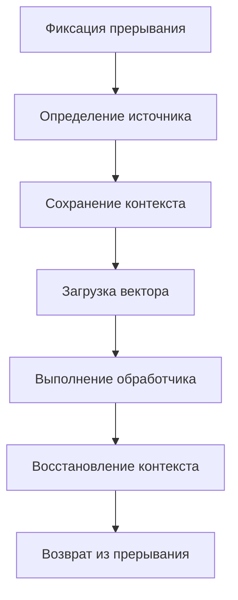
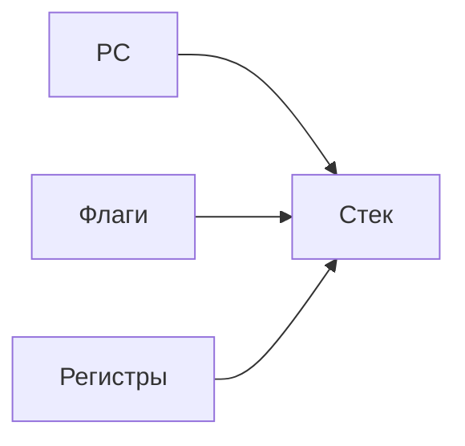
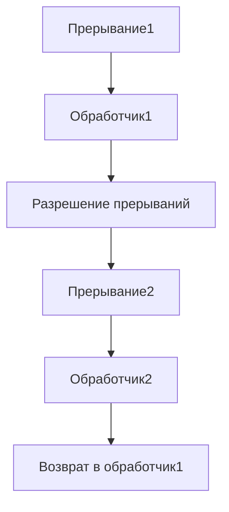

## 1. Полный цикл обработки прерывания

## 2. Детализация этапов

### 2.1 Инициирование прерывания

|Сигнал|Источник|Приоритет|
|---|---|---|
|IRQ0|Таймер|Высокий|
|IRQ1|Клавиатура|Средний|
|NMI|Аппаратные сбои|Наивысший|

### 2.2 Сохранение контекста

## 3. Временная диаграмма
```mermaid
gantt
    title Время обработки прерывания
    dateFormat  S
    section Циклы
    Фиксация : 0, 2
    Определение : 2, 3
    Сохранение : 5, 5
    Обработка : 10, 15
    Восстановление : 25, 5
```
## 4. Сравнение архитектур

### 4.1 x86 (режим реальных адресов)

1. Сохранение FLAGS и CS:IP
    
2. Чистка флага IF
    
3. Переход по вектору
    

### 4.2 ARM Cortex-M

1. Автоматическое сохранение 8 регистров
    
2. Векторная таблица в начале памяти
    
3. Использование PSP/MSP
    

## 5. Особые случаи обработки

### 5.1 Вложенные прерывания

### 5.2 Обработка ошибок

- Двойные исключения
    
- Ошибки страниц памяти
    
- Таймауты обработки
    

## 6. Оптимизации обработки

|Метод|Эффект|Сложность|
|---|---|---|
|Предварительное сохранение|Уменьшает задержку|Требует регистров|
|Приоритетная обработка|Улучшает реакцию|Усложняет контроллер|
|Пакетная обработка|Снижает накладные|Увеличивает задержку|