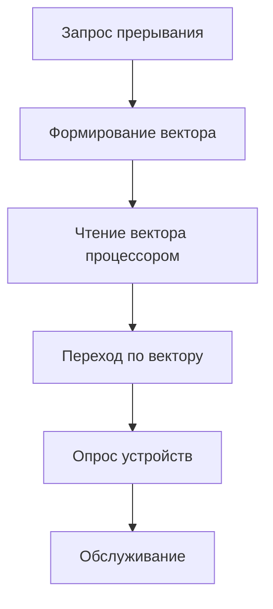
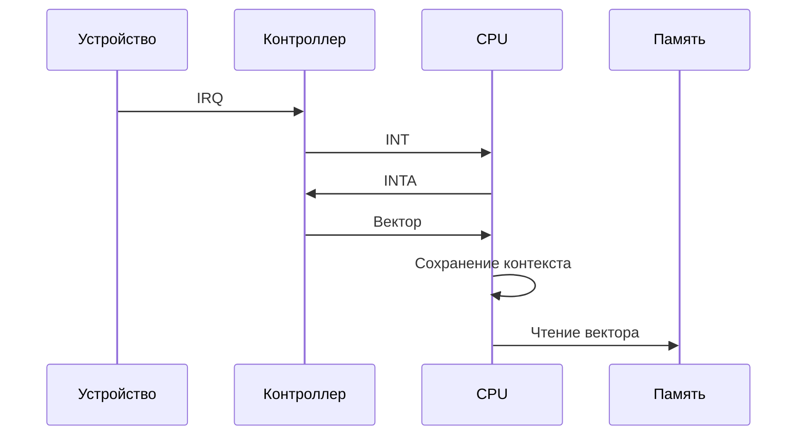

## 1. Принцип работы векторной системы

## 2. Компоненты системы

### 2.1 Аппаратные элементы:

|Устройство|Функция|
|---|---|
|Контроллер прерываний|Генерация вектора|
|Шина данных|Передача вектора|
|Дешифратор адресов|Идентификация устройства|

### 2.2 Этапы обработки:

1. Получение вектора прерывания
    
2. Определение приоритета
    
3. Последовательный опрос устройств
    
4. Вызов соответствующего обработчика
    

## 3. Временные характеристики
```mermaid
gantt
    title Тайминг обработки векторного прерывания
    dateFormat  S
    section Циклы
    Запрос : 0, 2
    Формирование вектора : 2, 3
    Чтение вектора : 5, 2
    Опрос устройств : 7, 8
    Обслуживание : 15, 20
```
## 4. Сравнение методов

| Параметр           | Векторные | С опросом | Комбинированные |
| ------------------ | --------- | --------- | --------------- |
| Скорость           | Высокая   | Средняя   | Высокая         |
| Аппаратные затраты | Большие   | Малые     | Средние         |
| Гибкость           | Низкая    | Высокая   | Средняя         |
## 5. Пример реализации (x86)

## 6. Особенности проектирования

### 6.1 Преимущества:

- Быстрое определение источника
    
- Поддержка приоритетов
    
- Минимальные задержки
    

### 6.2 Недостатки:

- Требует дополнительных линий
    
- Сложность масштабирования
    
- Жесткая привязка к векторам
