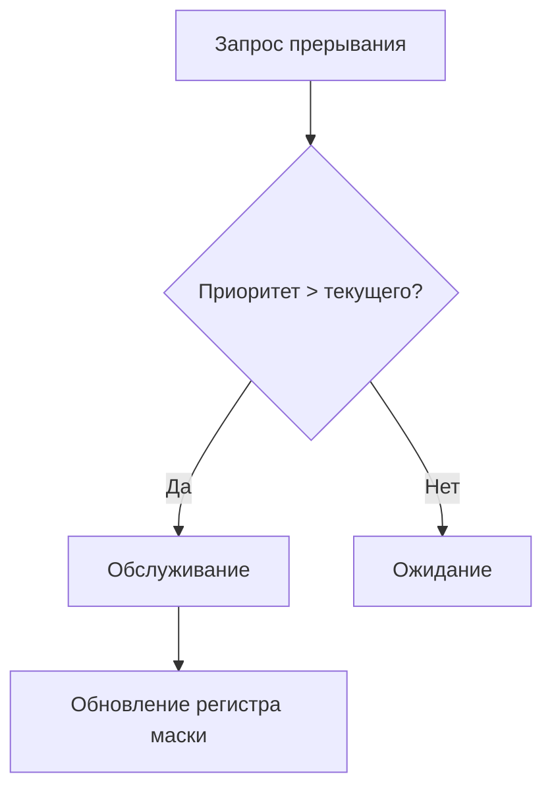
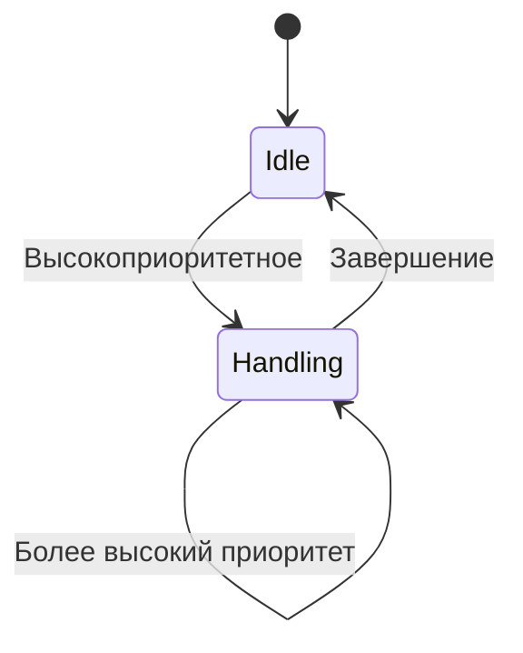
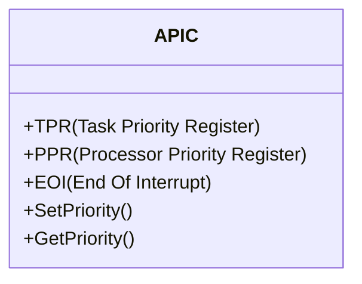

## 1. Принцип работы системы

## 2. Ключевые компоненты

### 2.1 Управляющие регистры:

|Регистр|Назначение|Разрядность|
|---|---|---|
|PR (Priority Register)|Установка текущего приоритета|3-8 бит|
|MASK|Маскирование прерываний|По битам|
|STATUS|Состояние системы прерываний|Флаги|

### 2.2 Алгоритм обработки:

1. Сравнение приоритета запроса с текущим уровнем
    
2. Программное изменение уровня чувствительности
    
3. Динамическое перераспределение приоритетов

## 4. Программный интерфейс управления

### 4.1 Типовые команды:
```asm
SET_PRIORITY 0x3    ; Установка уровня 3
ENABLE_IRQ 0b1101   ; Разрешение прерываний
DISABLE_IRQ 0xFF    ; Запрет всех прерываний
```
### 4.2 Пример для ARM Cortex-M:
```c
NVIC_SetPriority(IRQn_Type IRQn, uint32_t priority);
NVIC_EnableIRQ(IRQn_Type IRQn);
```
## 5. Сравнение методов управления

| Характеристика    | Фиксированный | Программируемый     | Адаптивный    |
| ----------------- | ------------- | ------------------- | ------------- |
| Гибкость          | Низкая        | Высокая             | Очень высокая |
| Накладные расходы | Минимальные   | Средние             | Высокие       |
| Время реакции     | Постоянное    | Зависит от настроек | Переменное    |

